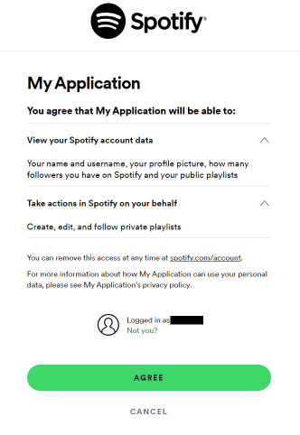

# spotify-song-grabber
Gets your currently playing song on Spotify and adds it to a designated playlist. For those moments when you want to save a song to your Spotify account without opening the app and choosing where to save it. It is recommended to created a new playlist for this purpose, but this will also work with an existing playlist. This program is most useful when bound to a keyboard shortcut. There are instructions for this at the end of this README file.

## Dependencies:
* `SwSpotify`
* `spotipy`
* Must have a Spotify developer account (easy to create)
#### Run the following commands in your python development environment to install the above libraries:
```
pip install SwSpotify
pip install spotipy
```

## Steps for basic functionality
1. Obtain a Spotify developer account by visiting this website: https://developer.spotify.com/
2. Under [user dashboard](https://developer.spotify.com/dashboard), create a new app and set its properties as follows:
```
set redirect URI to "http://localhost:8888/callback"
select "Web API"
```


3. Copy and paste the client id and secret from the developer website into the config file


5. Find the playlist you want to use, go to the options menu of the playlist and under "Share" click "Copy link to playlist." The playlist ID is the part of this url between "https://open.spotify.com/playlist/" and the query part of the url (starting with '?').
6. Paste the playlist ID into the PLAYLIST_ID field in config.py
7. Change the SCOPE and USERNAME fields in config.py accordingly (SCOPE should be set to "playlist-modify-private" for private playlists and "playlist-modify-public" for public playlists)
8. When the program first runs, make sure to select agree in the window that pops up



## To bind to a keyboard shortcut
1. Create new desktop shortcut
2. Under properties set "target" to 'path_to_folder'/src/main.py
3. Set shortcut key to whatever you'd like
4. Set it to run minimized
5. (Optional): Set shortcut icon to to "sample_icon.ico" (in repo folder)
6. (Optional): Set playlist icon to "sample_icon.jpg" (in repo folder)
